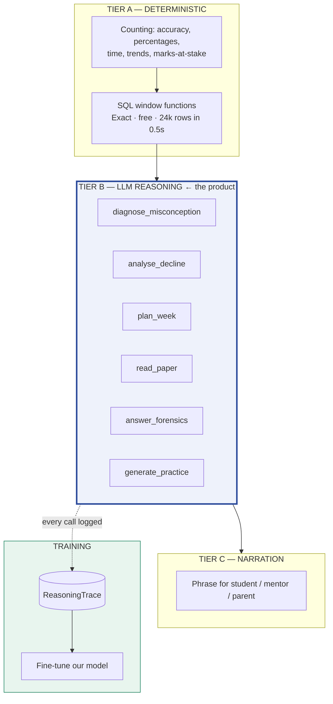
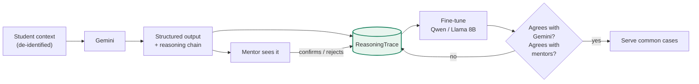
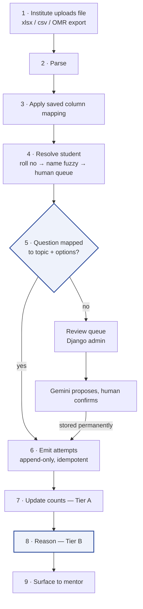
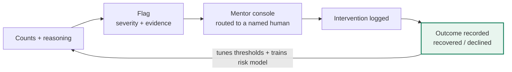

# Student AI — Technical Specification

**v2.0 · 25 Sep 2026**
Entry point: [`README.md`](README.md) · Next steps: [`TASKS.md`](TASKS.md) · History: [`PROJECT_LOG.md`](PROJECT_LOG.md)

> **v2.0 consolidates and supersedes** `LLM_ARCHITECTURE.md`, `SYSTEM_DESIGN.md`, `WORKFLOW.md`, `AGENT_HANDOFF.md`, `architecture.html` and `build-plan.html`. Those are deleted. Where any surviving note disagrees with this document, this document wins.

---

## 1 · What this is

A domain LLM for Indian competitive-exam preparation (JEE / NEET), sold to coaching institutes.

It ingests the mock-test results an institute already has and produces the judgement a good teacher makes when reading an answer sheet: **not what the student scored, but what they misunderstand, how much it costs them, and what to do about it.**

Every piece of reasoning Gemini does is logged, and those transcripts become the training set for our own fine-tuned model.

### The correction from v1.0

v1.0 said *"the LLM narrates; it never computes."* Half right:

| | Verdict |
|---|---|
| Using an LLM to compute rolling accuracy | **Wrong then, wrong now.** Arithmetic over 24,000 rows — 12,480 API calls/day for a worse answer than a window function gives free. Stays deterministic. |
| Treating diagnosis, causal analysis and planning as "narration" | **That was the error.** These are judgement tasks. An LLM is the right tool; a rules engine is dramatically worse. Calling them narration mis-sized the product. |
| *"Distillation doesn't apply — labels are free"* | **Wrong.** True for knowledge tracing (right/wrong is ground truth). False for reasoning — there is no ground truth for *"what misconception does this pattern reveal?"* Gemini's traces **are** the signal. |

---

## 2 · The blocker that gates everything

| We store | We do not store |
|---|---|
| Question **ID** (`Q17`) | Question **text** — 0 of 525 populated |
| Right / wrong / blank / not-reached | **Which option the student chose** |
| Topic mapping | The **options** themselves |
| Time spent | The **solution** |
| | What each **wrong option represents** |

The richest prompt we can currently build is:

> *"Student 4471 answered Q17 incorrectly. Topic: Rotational Motion. Time: 145s."*

No model produces a diagnosis from that. It produces *"focus more on Rotational Motion"* — unfalsifiable and worthless.

With content:

> *"Aarav picked (C) on Q17 — the distractor for using the centre-of-mass axis when rotation is about the end. Same class of distractor on Q31 and Q44. On the two rotational questions where the axis was stated explicitly, he was correct. This is not 'weak at rotational motion'; it is a repeated failure to locate the axis when the problem doesn't state it."*

**The ceiling is the input, not the model.**

---

## 3 · Three tiers



**The rule for deciding which tier something belongs to:**

> If the answer is a **number that must be exactly right and is computable by counting** → Tier A.
> If the answer is a **judgement a good teacher would make differently from a bad one** → Tier B.

Accuracy percentage is Tier A. *"Is this carelessness or a real gap?"* is Tier B.

**Tier A is not a constraint on Tier B — it is what makes Tier B credible.** The model reasons over exact numbers rather than inventing them, which is why its diagnoses can be checked against the record.

---

## 4 · Misconception taxonomy — the actual IP

A **misconception** is a systematic wrong belief that produces *predictable* wrong answers. Not carelessness — a stable, wrong mental model.

Every wrong option on every question is tagged with the misconception that produces it:

```
Q17. A uniform rod of mass M, length L rotates about one end…
  (A) ML²/3    ✓ correct
  (B) ML²/12   ✗ MIS-ROT-AXIS   — used the centre-of-mass axis
  (C) ML²/2    ✗ MIS-ROT-DISC   — applied the disc formula to a rod
  (D) ML²      ✗ MIS-ROT-POINT  — treated it as a point mass
```

One student picking (B) once is noise. **The same student picking `MIS-ROT-AXIS` across four questions is a diagnosis** — evidenced, quantifiable in marks, and targetable with generated practice.

It also makes the LLM's reasoning **falsifiable**: the claim *"he has an axis-identification problem"* can be checked against the distractor record.

### Starter taxonomy

| Code | Subject | The wrong belief |
|---|---|---|
| `MIS-ROT-AXIS` | Physics | Uses centre-of-mass axis when rotation is about another point |
| `MIS-SIGN-FIELD` | Physics | Sign errors on field / force direction |
| `MIS-KIN-AVG` | Physics | Confuses average with instantaneous velocity |
| `MIS-ORG-MARKOV` | Chemistry | Markovnikov vs anti-Markovnikov addition |
| `MIS-EQM-CATALYST` | Chemistry | Believes a catalyst shifts equilibrium position |
| `MIS-BOND-COUNT` | Chemistry | Miscounts σ vs π bonds |
| `MIS-ALG-SQUARE` | Maths | Gains or loses roots when squaring both sides |
| `MIS-TRIG-DOMAIN` | Maths | Ignores domain restrictions on inverse trig |
| `MIS-CALC-CHAIN` | Maths | Drops the inner derivative in the chain rule |

Extends as real papers are mapped. This is built from our own data and cannot be bought.

---

## 5 · Tier B reasoning tasks

Each is a defined job with **structured JSON output** — not an open chat prompt. Structure is what makes output checkable, storable, and usable as training data.

| Task | Input | Output | Why an LLM |
|---|---|---|---|
| `diagnose_misconception` | Distractor choices on a topic + misconception tags | Ranked hypotheses, evidence, confidence | Pattern inference over sparse noisy evidence |
| `analyse_decline` | Timeline: scores, time allocation, revision gaps, confidence | Causal narrative + the single highest-value intervention | Weighing competing explanations |
| `plan_week` | Gaps, exam date, hours, class schedule, topic weights | Ordered plan, each block justified | Constrained planning with trade-offs |
| `read_paper` | Raw paper (PDF/text) | Per question: topic, difficulty, what each distractor tests | Language + domain understanding |
| `answer_forensics` | Question + student's working | Where the reasoning broke; which misconception | Reading mathematical reasoning |
| `generate_practice` | A confirmed misconception + difficulty | Questions whose distractors target that exact error | Grounded generation |
| `weekly_summary` | All of the above | Mentor- and parent-facing prose | Tier C |

### Privacy — non-negotiable

Users are minors, and Gemini's free tier may use submitted content for training, with human review. **PII is stripped before every call** and re-attached locally afterwards:

```json
{ "student_ref": "S-4471", "exam": "JEE Main", "weeks_to_exam": 34,
  "distractors": [{"q": "Q17", "chose": "C", "misconception": "MIS-ROT-AXIS"}] }
```

No name, roll number, phone, DOB or institute name ever leaves our system.

---

## 6 · Training our own model



**`ReasoningTrace`** records per call: task type, exact input context, model + prompt version, structured output, reasoning chain, latency, cost, and **whether a human later agreed**.

That last field is what makes the corpus worth more than raw Gemini output. A mentor confirming a diagnosis converts a *teacher-model guess* into a *human-validated example*.

| Stage | Traces | What happens | Cost |
|---|---|---|---|
| 1 · Collect | 0 → 5,000 | Gemini does everything; all logged | Free tier |
| 2 · Distil narrow | ~5,000 | Fine-tune on **one** task (`diagnose_misconception`) — short, structured output | ~$10–50 GPU |
| 3 · Evaluate | — | Agreement with Gemini on held-out cases, then with mentors (the real metric) | Free |
| 4 · Route | ~20,000 | Ours handles common cases; Gemini handles hard ones and keeps teaching | Lower |
| 5 · Widen | 50,000+ | More tasks, hardest last | — |

**Not** training from scratch. Fine-tuning an existing open model on domain traces — a different and entirely achievable thing.

---

## 7 · Data model

### The spine
`Exam → Subject → Unit → Topic`, **versioned per institute** (two centres split chapters differently; a global tree does not survive the second customer). Every event references a `topic_id`.

### Current tables — 21, built and working

| Group | Tables |
|---|---|
| Tenancy | `institute` · `batch` · `student` · `mentor` · `user` |
| Syllabus | `exam` · `syllabus_version` · `topic` |
| Events *(append-only)* | `attempt` · `study_log` · `confidence_rating` · `revision_event` · `chapter_status` |
| Ingestion | `test_paper` · `ingest_batch` · `column_mapping_profile` · `question_topic_map` |
| Derived *(disposable)* | `topic_state` · `student_state` · `flag` · `intervention` · `plan_block` |

### To add — gates the reasoning layer

| Table / field | Purpose |
|---|---|
| `Question` — text, options, correct option, solution, difficulty | Content to reason about |
| `QuestionOption` — label, text, `is_correct`, **`misconception` FK** | What each wrong answer means |
| `Misconception` — code, subject, description | The diagnostic vocabulary |
| **`Attempt.chosen_option`** | Without it, distractor analysis is impossible |
| `ReasoningTrace` | The training corpus |

### Invariants

1. **Event tables are append-only.** Corrections arrive as new rows. This is what lets us change the mastery model in month six and replay two years of history to see what it *would* have flagged.
2. **Derived state is always rebuildable from events alone.**
3. **Syllabus versions are immutable** once events reference them.

### Tenant isolation — live and verified

PostgreSQL row-level security, enforced by a non-superuser role (`student_ai_rls`) that `TenantMiddleware` switches into per request.

```
institute 1 → 24,000 attempts        institute 2 → 0
unset setting → 0 rows (fails closed)
cross-tenant INSERT → refused
```

> ⚠ **Two traps, both live.** The `sai` role in `DATABASE_URL` is SUPERUSER/BYPASSRLS, so `FORCE ROW LEVEL SECURITY` alone is insufficient and a naive RLS test **passes vacuously**. And `TenantMiddleware` reads `request.user` — if JWT/token auth is ever added, it silently stops scoping and must move into a DRF authentication class.

---

## 8 · Ingestion — mock file to insight



**Step 5 is the gate.** An unmapped question is a number with no meaning. Mapping is a one-time cost per paper that pays out on every future student who sits it — so it is stored permanently with human confirmation, **never inferred at runtime**.

Mapping ladder, cheapest first: institute already tags by chapter → paper blueprint → **Gemini proposes, human confirms**.

---

## 9 · The risk loop must close



Detection is the easy half. The return arrow is the product — it produces the only number that renews a contract: *"of 23 students flagged last term, 17 recovered after mentor contact."*

**Alert hygiene**, all three mandatory or mentors stop reading by week three:
1. **Minimum evidence** — never fire on fewer than N observations
2. **Personal baseline** — compare a student to their own history, never the cohort
3. **Cooldown** — one flag per (student, type, **topic**) per window

> A bug found and fixed on 25 Sep: nothing could *resolve* a flag, and the cooldown keyed on `(student, type)` only — so one open `weak_topic` silenced that detector on every other chapter, permanently. Seven of eight detectors had gone mute. `POST /api/flags/{id}/resolve/` now exists; the cooldown includes `topic_id`. Raisable flags went 5 → 43.

**`intervene` deliberately does not auto-resolve.** Contacting a student is not the same event as the student recovering, and `Flag.outcome` is a training label for the risk model — it must record what happened weeks later, not the phone call. `outcome` is required, not defaulted: an honest `declined` is worth more than a polite blank.

---

## 10 · Tech stack

| Layer | Choice | Why | Alternatives |
|---|---|---|---|
| Language | Python 3.14 | ML/data tooling is Python-native | Node, Java — split codebase for no gain |
| Backend | Django 6.1 + DRF | Admin gives the mapping review queue, syllabus editor and tenant onboarding free — a large share of this product's internal tooling | FastAPI — hand-build all of that |
| Database | PostgreSQL 16 | Window functions *are* the Tier-A engine; JSONB, RLS, partitioning all load-bearing | None; not a preference |
| Tenancy | Shared schema + `tenant_id` + RLS | Enforced in the DB, not in code someone forgets | Schema-per-tenant (migration pain ~20 customers) |
| Jobs | django-q2, ORM broker | Uses existing Postgres — no Redis service | Celery + Redis when outgrown |
| Contract | OpenAPI via drf-spectacular | Frontend and backend can't drift silently; breaks the build instead | Informal agreement — always drifts |
| Console | React + Vite + shadcn/ui | Pre-built accessible components | Vue, Angular, HTMX |
| **Reasoning** | **Google Gemini** | Usable free tier at our scale | GPT, Claude — swappable, see below |
| **Our model** | Qwen / Llama 8B, fine-tuned | Free to run, domain-specific, ours | From scratch — millions, no benefit |
| Hosting | Docker, India region | DPDP residency (users are minors) | Cloud later; no rebuild needed |

**Gemini is swappable.** Because reasoning is a bounded layer with structured inputs and outputs, replacing the provider touches one module and no arithmetic. Its terms changed twice in 2026 — keep it that way.

---

## 11 · Build order

| # | Build | Gate it removes |
|---|---|---|
| 1 | `Question`, `QuestionOption`, `Misconception` | Nothing works without content |
| 2 | `Attempt.chosen_option` | No distractor analysis |
| 3 | Seed real JEE papers with tagged distractors | Something to reason about |
| 4 | **Regenerate answers with consistent error patterns** | Random wrongness has no pattern to find |
| 5 | `ReasoningTrace` | Traces not captured are gone |
| 6 | Gemini client + `diagnose_misconception` | First real reasoning |
| 7 | Remaining Tier-B tasks | The product |
| 8 | Fine-tune harness | Our own model |

> **Step 4 is the one most likely to be underestimated.** The current seed ranks questions by a latent ability score and marks the top *c* correct — producing students at a flat 0% and wrong answers with no structure. Run a diagnosis engine over that and it finds nothing, because nothing is there. **The fake data must contain the patterns we intend to detect**, or Tier B has no way to prove it works.

---

## 12 · Known defects

| Severity | Defect | Owner |
|---|---|---|
| **High** | Mock analyzer books *"mastery unknown"* as *"conceptual gap"*. `analyse_mock` filters `mastery__isnull=False`, so chapters withheld by the 4-attempt evidence floor arrive as `None` and are routed to `CONCEPTUAL_GAP`. **10,705 marks rest on a NULL**; 270 (student, topic) pairs with `attempts_n = 0` have blanks booked as proven gaps. Since `recoverable = total − conceptual_gap`, this understates the headline the product sells on. Needs a fifth bucket, and changes the contract | backend |
| Medium | `weak_topic` marks gate is a *lifetime* total shown next to a 20-attempt decayed mastery — "costing 42 marks" is a career figure | backend |
| Medium | `accuracy_30d` is null for 86% of rows; degenerate 0/1 where present | backend |
| Medium | Seed realism — 41 of 75 `weak_topic` flags read "0% over N attempts" | data |
| Low | Neglect chart: value labels detach from short bars | frontend |
| — | Console has **never** been pointed at the live API — MSW mocks only | frontend |

---

## 13 · Open problems

1. **Question→topic mapping at scale.** One-time cost per paper, reused forever — Gemini proposes, human confirms, result stored. Never runtime inference.
2. **Cold start.** A new student has no history. Week one must still be useful: diagnostic test, imported past mocks, or an explicit provisional mode that says *"still learning your pattern"* rather than inventing confidence.
3. **Self-reported data is unreliable.** Students forget, log optimistically, bulk-enter a week on Sunday. Never let a detector depend solely on it.
4. **Attribution.** Proving an intervention *caused* an improvement needs staggered rollout designed into the pilot up front, not reconstructed after.
5. **Deadline-aware spaced repetition.** No library optimises for recall on a fixed date with a frozen syllabus. Research-flavoured work.
6. **Gemini free-tier dependency.** 500 requests/day; Pro left the free tier Apr 2026. Keep the layer swappable.

---

## 14 · Current state

```
✅ 21 tables · RLS verified · 24,000 seeded attempts
✅ Tier A counting engine · 8 detectors · alert hygiene
✅ 25 API endpoints · OpenAPI contract in sync
✅ React console (on mock data) · 68 tests passing
❌ Tier B reasoning — not started
❌ Question content — the blocker
❌ Training pipeline — not started
```
