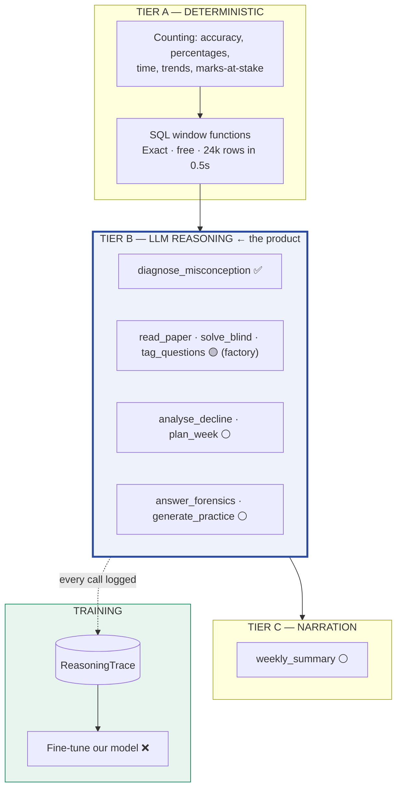
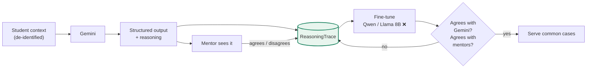
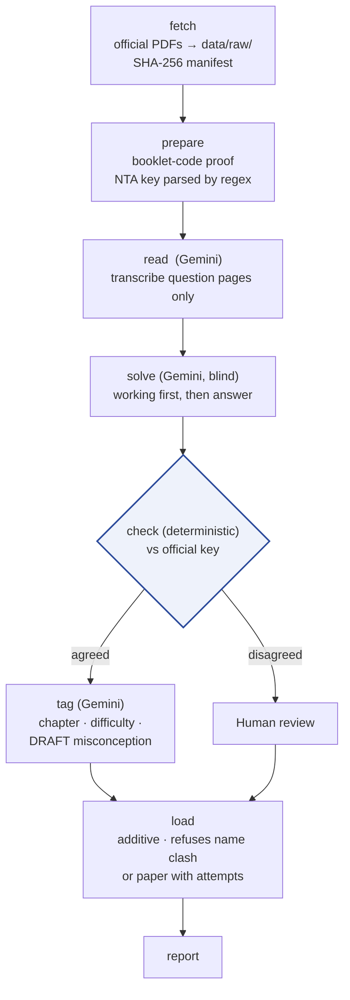
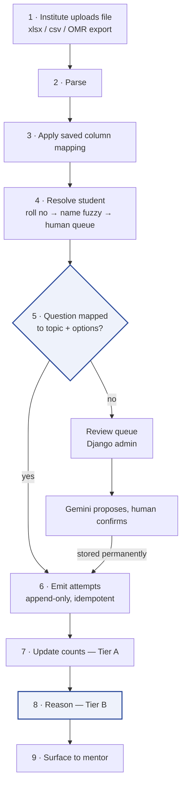
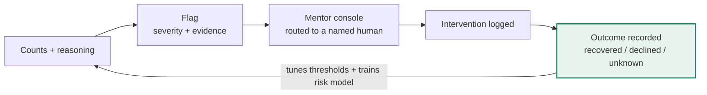

# Student AI — Technical Specification

**v3.0 · 10 Oct 2026**
Entry point: [`README.md`](README.md) · Next steps: [`TASKS.md`](TASKS.md) · History: [`PROJECT_LOG.md`](PROJECT_LOG.md) · Data shelves: [`data/README.md`](data/README.md)

> **v3.0 re-baselines v2.0 (25 Sep) against the code.** The reasoning thesis in v2.0 held up and is kept. What changed is the *state of the build*: the content blocker is gone, the first Tier B task is live, a question factory exists, and the console talks to the real API. Every status claim below was checked against the code on 10 Oct. Figures taken from the dev database are marked *(dev DB, 10 Oct)* and will drift.
>
> v2.0 consolidated and superseded `LLM_ARCHITECTURE.md`, `SYSTEM_DESIGN.md`, `WORKFLOW.md`, `AGENT_HANDOFF.md`, `architecture.html` and `build-plan.html`. Those are deleted. Where any surviving note disagrees with this document, this document wins.

**Status legend:** ✅ built and working · 🟡 built, with a stated limit · ⚪ model/enum only, nothing runs it · ❌ not started

---

## 1 · What this is

A domain LLM for Indian competitive-exam preparation (JEE / NEET), sold to coaching institutes.

It ingests the mock-test results an institute already has and produces the judgement a good teacher makes when reading an answer sheet: **not what the student scored, but what they misunderstand, how much it costs them, and what to do about it.**

Every piece of reasoning Gemini does is logged, and those transcripts become the training set for our own fine-tuned model.

The buyer is the institute director, not the student. The built product is therefore a **director / mentor console**; there is no student-facing app.

### The correction from v1.0

v1.0 said *"the LLM narrates; it never computes."* Half right:

| | Verdict |
|---|---|
| Using an LLM to compute rolling accuracy | **Wrong then, wrong now.** Arithmetic over 24,000 rows — 12,480 API calls/day for a worse answer than a window function gives free. Stays deterministic. |
| Treating diagnosis, causal analysis and planning as "narration" | **That was the error.** These are judgement tasks. An LLM is the right tool; a rules engine is dramatically worse. Calling them narration mis-sized the product. |
| *"Distillation doesn't apply — labels are free"* | **Wrong.** True for knowledge tracing (right/wrong is ground truth). False for reasoning — there is no ground truth for *"what misconception does this pattern reveal?"* Gemini's traces **are** the signal. |

---

## 2 · The blocker, and what is left of it

On 25 Sep the whole reasoning layer was gated on input. We stored a question *ID* and a right/wrong flag, and nothing a model could reason about:

| Then (25 Sep) | Now |
|---|---|
| Question **text** — 0 of 525 populated | ✅ `QuestionTopicMap.question_text`, `solution`, `difficulty` |
| **Which option the student chose** — did not exist | ✅ `Attempt.chosen_option` |
| The **options** themselves | ✅ `QuestionOption` (label, text, `is_correct`) |
| What each **wrong option represents** | ✅ `QuestionOption.misconception` FK → `Misconception` |

The richest prompt we could build then was *"Student 4471 answered Q17 incorrectly. Topic: Rotational Motion. Time: 145s."* — from which no model produces anything but *"focus more on Rotational Motion."* With content it produces a falsifiable diagnosis (see §5). **The ceiling is the input, not the model** — that argument stands, and it is why §8 exists.

### What is still thin

| Gap | Detail |
|---|---|
| Student answers are **100% synthetic** | 24,000 `seed_demo` attempts plus ~2,000 diagnostic-paper attempts. Only the 4 "hero" students carry engineered error patterns. |
| Fully tagged content is **one 46-question paper** | The diagnostic paper has 63 FK-tagged distractors. The two real papers (255 questions) carry only *draft* misconception codes, unconfirmed by a person. |
| `seed_demo` mocks 8–14 have **no question text** | 7 papers × 75 questions: labels and right/wrong only. |
| Only **2,024 of 26,024** attempts carry a `chosen_option` *(dev DB, 10 Oct)* | Distractor analysis works only where those exist. |

The remaining blocker is no longer "no content" but **"real content, tagged by a person, on realistic students."**

---

## 3 · Three tiers


```mermaid
graph TD
    subgraph A["TIER A — DETERMINISTIC"]
        A1["Counting: accuracy, percentages,<br/>time, trends, marks-at-stake"]
        A2["SQL window functions<br/>Exact · free · 24k rows in 0.5s"]
    end
    subgraph B["TIER B — LLM REASONING  ← the product"]
        B1["diagnose_misconception ✅"]
        B2["read_paper · solve_blind · tag_questions 🟡 (factory)"]
        B3["analyse_decline · plan_week ⚪"]
        B4["answer_forensics · generate_practice ⚪"]
    end
    subgraph C["TIER C — NARRATION"]
        C1["weekly_summary ⚪"]
    end
    subgraph T["TRAINING"]
        T1[("ReasoningTrace")]
        T2["Fine-tune our model ❌"]
    end

    A1 --> A2 --> B
    B --> C
    B -.every call logged.-> T1
    T1 --> T2

    style B fill:#eef2fb,stroke:#2B4A9B,stroke-width:3px
    style T fill:#e8f5ee,stroke:#0E7C57
```

**The rule for deciding which tier something belongs to:**

> If the answer is a **number that must be exactly right and is computable by counting** → Tier A.
> If the answer is a **judgement a good teacher would make differently from a bad one** → Tier B.

Accuracy percentage is Tier A. *"Is this carelessness or a real gap?"* is Tier B.

**Tier A is not a constraint on Tier B — it is what makes Tier B credible.** The model reasons over exact numbers rather than inventing them, which is why its diagnoses can be checked against the record. No Tier A service ever calls an LLM.

> **Naming collision.** Each *detector* also declares a `tier` — there it means data need (0 = marks only, 1 = needs student-logged data). Unrelated to Tier A/B/C above.

### What Tier A actually computes ✅

| Quantity | Definition | Where |
|---|---|---|
| **Mastery** (per student × topic) | Decayed accuracy over the student's last 20 attempted questions in the topic, 30-day half-life, anchored to the pair's newest attempt. **Below 4 attempts it is NULL, not 0** — absence of evidence is not a gap | `derived/services/features.py` |
| **Marks lost** | A wrong answer costs 5, a skip 4; cumulative across all papers | `features.py` |
| **`risk_score`** | **0–1** (not 0–100). Weights: decline 0.50 · subject imbalance 0.20 · inconsistency 0.20 · debt 0.10. A student is *at risk* at ≥ 0.55 | `features.py`, `api/views.py` |
| **Mock analysis** | Every lost mark is booked to one of **five causes**: `conceptual_gap` (wrong, mastery < 0.60) · `execution_error` (wrong, mastery ≥ 0.60) · `time_exhaustion` · `avoidable_skip` · `insufficient_evidence` (mastery unknown). Speed rule: > 2× the student's own median correct-answer time, needing ≥ 8 correct answers for a baseline | `events/services/mock_analysis.py` |
| **Recoverable marks** | The **sum of the three evidenced causes** (execution + time + skip) — *not* `total − conceptual_gap`. `insufficient_evidence` is deliberately excluded from both sides; an unmeasured chapter has been shown to be neither a gap nor recoverable | `mock_analysis.py` |

`recompute_features` rebuilds mastery and student state; `run_detectors` raises flags. Both are **manual `manage.py` commands** — there is no scheduler (§10).

---

## 4 · Misconception taxonomy — the actual IP

A **misconception** is a systematic wrong belief that produces *predictable* wrong answers. Not carelessness — a stable, wrong mental model.

Every wrong option on every (fully tagged) question carries the misconception that produces it. *Illustrative only — the rod question below is a teaching example; `MIS-ROT-DISC` and `MIS-ROT-POINT` are not codes in the taxonomy:*

```
Q17. A uniform rod of mass M, length L rotates about one end…
  (A) ML²/3    ✓ correct
  (B) ML²/12   ✗ MIS-ROT-AXIS   — used the centre-of-mass axis
  (C) ML²/2    ✗ (disc formula)  — applied the disc formula to a rod
  (D) ML²      ✗ (point mass)    — treated it as a point mass
```

A real one, from the diagnostic paper (paper question `D16`):

```
Nitration of toluene with a HNO3/H2SO4 mixture gives predominantly:
  (B) o- and p-nitrotoluene    ✓ correct
  (C) m-nitrotoluene           ✗ MIS-ORG-EAS — activating group sends the incoming group to meta
```

One student picking a distractor once is noise. **The same student picking the same misconception across several questions is a diagnosis** — evidenced, quantifiable in marks, and targetable with practice. It also makes the LLM's reasoning **falsifiable**: *"he has an axis-identification problem"* can be checked against the distractor record.

### Taxonomy — 15 codes ✅ (`ingestion/demo_questions.py`)

`Misconception.description` is written **in the student's voice, as the belief they hold**; `remedy` is a lesson a teacher can actually run. Both go straight into the model's prompt — they are what let it explain *why*.

| Code | Subject | The wrong belief |
|---|---|---|
| `MIS-ROT-AXIS` | Physics | Uses the tabulated (centre-of-mass) axis when rotation is about another point |
| `MIS-ROT-SHAPE` | Physics | Treats the standard moment-of-inertia results as one interchangeable family |
| `MIS-SIGN-FIELD` | Physics | Sign errors on field / force direction |
| `MIS-KIN-AVG` | Physics | Confuses average with instantaneous velocity / speed |
| `MIS-KIN-RELVEL` | Physics | Computes relative motion in the wrong frame |
| `MIS-ORG-EAS` | Chemistry | Directing effects reversed (activating group → meta) |
| `MIS-ORG-MARKOV` | Chemistry | Markovnikov vs anti-Markovnikov addition |
| `MIS-ORG-STABILITY` | Chemistry | Carbocation stability ordered by group size, not by effect |
| `MIS-EQM-CATALYST` | Chemistry | Believes a catalyst shifts equilibrium position |
| `MIS-BOND-COUNT` | Chemistry | Miscounts σ vs π bonds |
| `MIS-BOND-HYBRID` | Chemistry | Reads hybridisation off the formula ("carbon forms four bonds, so sp³") |
| `MIS-ALG-SQUARE` | Maths | Keeps roots gained by squaring both sides |
| `MIS-ALG-MODULUS` | Maths | Drops the sign cases of a modulus |
| `MIS-TRIG-DOMAIN` | Maths | Ignores domain / range restrictions on inverse trig |
| `MIS-CALC-CHAIN` | Maths | Drops the inner derivative in the chain rule |

### The taxonomy is already fragmenting on real papers ⚠

The factory (§8.1) asks Gemini to draft a misconception per wrong option. On the two real papers it proposed **"new" codes for 496 of 514 NEET distractors and 153 of 162 JEE distractors** — roughly 350 and 140 distinct draft codes *(from the extracted files, 10 Oct)*. These sit in `draft_misconception_*` fields; **only a person may set the real FK.** A consolidation pass (merge drafts into the 15-code vocabulary or promote the real new ones) is required before the taxonomy scales. Left alone, it stops being a vocabulary.

Built from our own data and cannot be bought — *if* it stays curated.

---

## 5 · Tier B reasoning tasks

Each is a defined job with **structured JSON output** — not an open chat prompt. Structure is what makes output checkable, storable, and usable as training data.

| Task | Input | Output | Status |
|---|---|---|---|
| `diagnose_misconception` | Wrong answers + the misconception each implies, counter-evidence | Ranked hypotheses, cited evidence, confidence, time-to-fix | ✅ **Live.** `GET /api/students/{id}/diagnosis/?paper=`; verified on all 4 hero students, correct misconception each time |
| `read_paper` | Official paper PDF (question pages only) | Transcribed questions + options | 🟡 Factory stage; `read-v1`, temperature 0 |
| `solve_blind` | Our transcription, *without* the official answer | The model's own answer, working first | 🟡 Factory stage; `solve-v3` |
| `tag_questions` | Question + options + syllabus | Chapter, difficulty, **draft** misconception per wrong option | 🟡 Factory stage; `tag-v2` |
| `analyse_decline` | Timeline: scores, time allocation, revision gaps, confidence | Causal narrative + the single highest-value intervention | ⚪ enum constant only |
| `plan_week` | Gaps, exam date, hours, class schedule, topic weights | Ordered plan, each block justified | ⚪ enum constant only |
| `answer_forensics` | Question + student's working | Where the reasoning broke; which misconception | ⚪ enum constant only |
| `generate_practice` | A confirmed misconception + difficulty | Questions whose distractors target that exact error | ⚪ enum constant only |
| `weekly_summary` | All of the above | Mentor- and parent-facing prose | ⚪ enum constant only (Tier C) |

> The `PlanBlock` table has **no engine**: it is written only by the seeder. A "day plan" panel exists in the console, but nothing plans.

### Privacy — non-negotiable

Users are minors, and Gemini's free tier may use submitted content for training, with human review. **PII is stripped before every call** and re-attached locally afterwards. The real payload (`diagnose.build_context`):

```json
{ "student_ref": "S-4471", "exam": "JEE_MAIN", "paper": "Mock 15 — Diagnostic",
  "wrong_answers":   [{"label": "D16", "stem": "...", "option_text": "...", "indicates": "MIS-ORG-EAS"}],
  "correct_answers": [...],
  "misconception_glossary":     {"MIS-ORG-EAS": {"description": "...", "remedy": "..."}},
  "marks_lost_by_pattern":      {"MIS-ORG-EAS": 25},
  "counter_evidence_by_pattern": {"MIS-ORG-EAS": [...]},
  "totals": {...} }
```

No name, roll number, phone, DOB or institute name ever leaves our system. A test asserts the payload for the hero student contains neither his name nor his roll number. Question stems are exam content, not PII.

### What the model is *not* trusted with

The model writes prose; Tier A re-owns anything countable. `present()` in `diagnose.py` runs after every call:

- **Citations are re-resolved server-side** against the student's own attempts to `{question_id, label, chose, marks_at_stake}`. `question_id: null` means the citation did not resolve — the console renders it as text, never as a link to nowhere. Hypotheses cannot overlap (one option per question, one misconception per option), so the total is a clean sum over distinct cited questions.
- **`marks_at_stake` is recomputed** as `5 × resolved citations`, not taken from the model. (`MARKS_PER_WRONG = 5` is hard-coded here, while the mock analyzer reads marks from the paper — see §12.)
- **`counter_evidence` is derived deterministically** and never blank: two different substituted sentences distinguish *"no counter-evidence on this paper"* from *"the model did not state it, treat this finding as un-narrowed."* A silence must not be reported as a finding.
- `ReasoningTrace.output` keeps the model's **raw JSON, untouched**. A training example that has been quietly corrected is not a training example.
- **Not validated:** the `misconception_code` the model chooses, its claim prose, and `time_to_fix`. These are exactly the fields a mentor's verdict is for.

### The Gemini client — what it guarantees ✅

- **Never fabricates.** No API key and no cached answer raises `NoCredentialsAndNoCache`; the endpoint returns a clean 503 in plain prose. There is deliberately no fallback that invents a diagnosis — fake AI output presented as real is the one failure this product could not survive.
- **Cache key = task + context hash + `prompt_version`.** `model` is deliberately excluded: a capacity fallback is incidental, not a change of intent. (An earlier key ignored `prompt_version`, so a v2 prompt would have kept serving v1 answers; fixed.)
- **A trace is written per attempt, failures included** — failures are training data too.
- **Model fallback chain, per task.** 404 / 429 / 5xx try the next model; 400 / 401 / 403 and invalid JSON stop. Quota is per model, so each task carries its own list.
- **Errors are prose for the reader.** 422 (`NoOptionsRecorded`, `NoMisconceptionTags`) and 503 bodies are written for a director reading over a mentor's shoulder; the technical string is logged, not shown.
- `documents.ask` (used by the factory) attaches PDFs and keys its cache on file SHA + page range.
- Tests are blocked from the network (`conftest.no_gemini_network`).

**Free-tier reality:** about **20 requests per model per day**, and 503 "busy" responses appear to count against it. Processing thousands of questions needs a small paid budget or batch mode.

---

## 6 · Training our own model


```mermaid
graph LR
    CTX["Student context<br/>(de-identified)"] --> G["Gemini"]
    G --> OUT["Structured output<br/>+ reasoning"]
    OUT --> TR[("ReasoningTrace")]
    OUT --> UI["Mentor sees it"]
    UI -->|agrees / disagrees| TR
    TR --> FT["Fine-tune<br/>Qwen / Llama 8B  ❌"]
    FT --> EVAL{"Agrees with<br/>Gemini?<br/>Agrees with<br/>mentors?"}
    EVAL -->|yes| ROUTE["Serve common cases"]
    EVAL -->|no| TR

    style TR fill:#e8f5ee,stroke:#0E7C57,stroke-width:2px
```

**`ReasoningTrace`** (`reasoning_reasoningtrace`, behind RLS) records per call: task type, exact input context, model + `prompt_version`, structured output, latency, **input and output token counts**, and **`human_verdict`** (`unreviewed` / `agreed` / `disagreed`).

Two corrections to v2.0: there is **no cost field** (tokens only), and the `reasoning` column exists but **nothing writes it** — the reasoning chain lives *inside* the structured output (`working` in `solve_blind`, `how_produced` in `tag_questions`).

`human_verdict` is what makes the corpus worth more than raw Gemini output: a mentor confirming a diagnosis converts a *teacher-model guess* into a *human-validated example*. `POST /api/students/{id}/diagnosis/verdict/` records it — but it stamps the student's **latest** diagnose trace, which is not necessarily the one on screen.

| Stage | Traces | What happens | Status |
|---|---|---|---|
| 1 · Collect | 0 → 5,000 | Gemini does everything; all logged | 🟡 **In progress.** 14 successful `diagnose` traces, 1 mentor-agreed *(dev DB, 10 Oct)*, plus one trace per factory call |
| 2 · Distil narrow | ~5,000 | Fine-tune on **one** task (`diagnose_misconception`) | ❌ No export, no harness |
| 3 · Evaluate | — | Agreement with Gemini on held-out cases, then with mentors (the real metric) | ❌ |
| 4 · Route | ~20,000 | Ours handles common cases; Gemini handles hard ones | ❌ |
| 5 · Widen | 50,000+ | More tasks, hardest last | ❌ |

**Not** training from scratch. Fine-tuning an existing open model on domain traces — a different and entirely achievable thing. ~5,000 traces is a long way off at 20 calls/model/day; the factory and `generate_practice` are the realistic volume sources.

---

## 7 · Data model

### The spine
`Exam → SyllabusVersion → Topic`, **versioned per institute** (two centres split chapters differently; a global tree does not survive the second customer). `Topic` is a self-referencing tree whose nodes have a `kind` of `subject`, `unit` or `chapter`. Every event references a chapter-level `topic_id`.

### Current tables — 25, built and working

| Group | Tables |
|---|---|
| Tenancy (5) | `User` · `Institute` · `Mentor` · `Batch` · `Student` |
| Syllabus (3) | `Exam` · `SyllabusVersion` · `Topic` *(+ `ncert_ref` JSON)* |
| Events, *append-only by convention* (5) | `Attempt` *(+ `chosen_option`)* · `StudyLog` · `ConfidenceRating` · `RevisionEvent` · `ChapterStatus` |
| Content & ingestion (6) | `TestPaper` *(+ provenance)* · `QuestionTopicMap` *(this is the question table)* · `QuestionOption` · `Misconception` · `IngestBatch` · `ColumnMappingProfile` |
| Derived (5) | `TopicState` · `StudentState` · `Flag` · `Intervention` · `PlanBlock` |
| Reasoning (1) | `ReasoningTrace` |

There is **no separate `Question` table**: `QuestionTopicMap` holds text, solution, difficulty, topic mapping and — for official papers — `official_answer`, `model_answer`, `nta_question_id` and `verification` (agreed / disagreed / unverifiable). `IngestBatch` and `ColumnMappingProfile` are **models and admin only; nothing writes to them** (§8.2).

**Provenance.** `TestPaper.provenance` is `official_pyq` / `demo` / `generated`, with `source_ref`. The console and the "Data & trust" page use it to say what is real.

### Syllabus versions

| Version | Chapters | NCERT-linked | State |
|---|---|---|---|
| `JEE_MAIN` v1 | 56 | 0 | **Active.** A placeholder typed from memory; all demo batches are bound to it. 43 of 56 names correct, 9 of 12 unit groupings invented |
| `JEE_MAIN` v2 | 54 | 51 | Official 2026 (NTA PDFs, every chapter traced to a page). Inactive |
| `NEET_UG` v1 | 71 | 68 | Official 2026. Inactive. Botany/Zoology split is **not** stated by NTA — tagged by content (17) or coaching convention (14, flagged) |

**Chapter weights are not measured anywhere.** The official trees leave `weight` at the 1.0 default; the v1 placeholder's weights are guesses (4/8/12). Real weights are to be counted from past papers. Three chapters cannot link to NCERT: *p-Block Elements* (no chapter in any current book, still examined), *Experimental Skills*, *Practical Chemistry*.

**Blockers before any batch moves to an official tree:** `SUBJECTS = ["Physics", "Chemistry", "Maths"]` is hard-coded in `api/views.py`, `derived/services/detectors.py` and `derived/services/features.py` — NEET's Botany and Zoology would be invisible — and seeders look up the active syllabus without an exam filter.

### Invariants — and how true they are today

| # | Invariant | Reality |
|---|---|---|
| 1 | **Event tables are append-only.** Corrections arrive as new rows; this is what lets us change the mastery model and replay history | 🟡 **Convention plus a read-only admin.** The DB role holds UPDATE/DELETE on every table, and `seed_demo --flush` deletes events |
| 2 | **Derived state is rebuildable from events alone** | 🟡 True for `TopicState` / `StudentState` (rebuild-tested; `--rebuild` drops only these two). **Not** true for `Flag.outcome`, `resolved_at` and `Intervention` — those are human input. `PlanBlock` has no engine. `retention` is always NULL |
| 3 | **Syllabus versions are immutable** once events reference them | ⚠ **Not enforced.** `TopicAdmin` allows editing `weight` / `position` on any version |

### Tenant isolation — live and verified ✅

PostgreSQL row-level security, enforced by a non-superuser role (`student_ai_rls`) that `TenantMiddleware` switches into per request. The tenant column is `institute_id`.

```
institute 1 → 24,000 attempts        institute 2 → 0        (seed_demo alone)
unset setting → 0 rows (fails closed)
cross-tenant INSERT → refused
```

- 20 policies in `tenancy/0003`, plus `reasoning_reasoningtrace` in `reasoning/0002`. `manage.py rls_check` proves it.
- **Gap:** `ingestion_questionoption` has no institute column and no policy; its parent question is policed, and `rls_check` does not cover the option table.
- Django **superusers are not RLS-scoped** (`middleware.py`); `TenantScopedMixin` is the second layer, and a superuser must pass `?institute=`. Management jobs run unscoped as the `sai` superuser unless wrapped in `tenant_scope`.

> ⚠ **Two traps, both live.** The `sai` role in `DATABASE_URL` is SUPERUSER/BYPASSRLS, so `FORCE ROW LEVEL SECURITY` alone is insufficient and a naive RLS test **passes vacuously**. And `TenantMiddleware` reads `request.user` — if JWT/token auth is ever added, it silently stops scoping and must move into a DRF authentication class.

### Authentication ✅

Django **session cookie + CSRF**. Endpoints: `GET /api/auth/csrf/` · `POST /api/auth/login/` · `POST /api/auth/logout/` · `GET /api/me/`. Role is derived from the user's link: `mentor` → mentor, `student` → student, else `is_staff` → director (`api/auth.py`). Pagination is 50 (max 200) per page, and 200 (max 500) for bulk routes.

---

## 8 · Content and ingestion

There are two ingestion problems. One is built; one is only designed.

### 8.1 · The question factory — official paper to tagged, checked questions ✅

**Rule: open book, not closed book.** The answer is always the official key. Gemini reads, solves and tags *from* official documents; it is never the source of a fact. (An LLM's memory of exam content is unreliable exactly where it matters — a live example: published sources disagreed on whether JEE Main numericals carry negative marking; the official bulletin settled it at −1.)


```mermaid
graph TD
    F1["fetch<br/>official PDFs → data/raw/<br/>SHA-256 manifest"] --> F2["prepare<br/>booklet-code proof<br/>NTA key parsed by regex"]
    F2 --> F3["read  (Gemini)<br/>transcribe question pages only"]
    F3 --> F4["solve  (Gemini, blind)<br/>working first, then answer"]
    F4 --> F5{"check  (deterministic)<br/>vs official key"}
    F5 -->|agreed| F6["tag  (Gemini)<br/>chapter · difficulty ·<br/>DRAFT misconception"]
    F5 -->|disagreed| R["Human review"]
    F6 --> F7["load<br/>additive · refuses name clash<br/>or paper with attempts"]
    R --> F7
    F7 --> F8["report"]

    style F5 fill:#eef2fb,stroke:#2B4A9B,stroke-width:2px
```

Run as `manage.py factory fetch|prepare|read|solve|check|tag|load|report|all|list` (`--max-calls`, `--force`, `--wait`, `--replace`). State is resumable JSON in `data/extracted/`, which — like `data/raw/` — is **not in git** (the GitHub repo is publicly readable).

Design points that matter:

- **The key is never the model's.** It is parsed by regex from NTA's key; a SHA-256 manifest check and a booklet-code proof (`structure.verify_booklet`) run with no model call.
- **Gemini sees only the question pages**, never the mirror's key pages — so the "blind" solve is blind.
- **Working before answer.** Gemini orders schema fields alphabetically, so the solver wrote its answer first and justified it after. Forcing `working` first took one model from 6/10 to 8/10.
- **LaTeX in JSON is corrupted** (`\theta` arrives as a tab) — 23 of 30 early questions — and is repaired deterministically.
- **Misconception drafts are drafts.** They land in `draft_misconception_*`; only a person sets the FK.

Results *(dev DB, 10 Oct)*:

| Paper | Questions | Agreed | Disagreed | Diagrams |
|---|---|---|---|---|
| JEE Main 2026 · 2 Apr · Shift 1 (official) | 75 | 66 (88.0%) | 9 | 8 |
| NEET UG 2025 · Code 45 | 180 | 157 (87.2%) | 23 | 24 |

**No official key was wrong.** Of the 32 disagreements, 2 were our *reading* errors (a square-root placement; options scrambled out of a 2×2 grid) — caught **only** because of the cross-check, and they would otherwise have shown wrong content to a director. The rest are the model solving wrongly, or figure questions to eyeball.

Limits to state plainly:
- **Agreement proves the question and its correct option — not every wrong option.** A spot-check found √ signs lost from two wrong options that still "agreed".
- **Sourcing:** the JEE paper and key are official NTA. NTA does not openly publish NEET papers, so the NEET paper is a Physics Wallah mirror; its booklet code was *proven* (matches NTA's code-45 key on 179 of 180; other codes at chance), not assumed.
- **All 32 disagreements are unreviewed** (`confirmed_at` empty everywhere). The agent notes are labelled *not a human review*.
- **The console has no maths renderer** (no KaTeX): real questions show raw LaTeX.

### 8.2 · Mock-file ingestion — designed, **not built** ❌

The pipeline below is the intended path from an institute's mock-test export to insight. **No code parses xlsx/csv, applies a column mapping, resolves students or emits attempts.** Only the `IngestBatch` / `ColumnMappingProfile` tables and their admin exist. Today all attempts arrive via `seed_demo` / `seed_questions`.


```mermaid
graph TD
    S1["1 · Institute uploads file<br/>xlsx / csv / OMR export"] --> S2["2 · Parse"]
    S2 --> S3["3 · Apply saved column mapping"]
    S3 --> S4["4 · Resolve student<br/>roll no → name fuzzy → human queue"]
    S4 --> S5{"5 · Question mapped<br/>to topic + options?"}
    S5 -->|yes| S6["6 · Emit attempts<br/>append-only, idempotent"]
    S5 -->|no| R1["Review queue<br/>Django admin"]
    R1 --> R2["Gemini proposes, human confirms"]
    R2 -->|stored permanently| S6
    S6 --> S7["7 · Update counts — Tier A"]
    S7 --> S8["8 · Reason — Tier B"]
    S8 --> S9["9 · Surface to mentor"]

    style S5 fill:#eef2fb,stroke:#2B4A9B,stroke-width:2px
    style S8 fill:#eef2fb,stroke:#2B4A9B,stroke-width:2px
```

**Step 5 is the gate.** An unmapped question is a number with no meaning. Mapping is a one-time cost per paper that pays out on every future student who sits it — so it is stored permanently with human confirmation, **never inferred at runtime**. The factory (§8.1) is exactly this idea applied to public papers; `QuestionTopicMapAdmin` already carries the review filters (unmapped / proposed / confirmed / verification) and a confirm action.

Mapping ladder, cheapest first: institute already tags by chapter → paper blueprint → **Gemini proposes, human confirms**.

---

## 9 · The risk loop must close


```mermaid
graph LR
    A["Counts + reasoning"] --> B["Flag<br/>severity + evidence"]
    B --> C["Mentor console<br/>routed to a named human"]
    C --> D["Intervention logged"]
    D --> E["Outcome recorded<br/>recovered / declined / unknown"]
    E -->|tunes thresholds + trains risk model| A

    style E fill:#e8f5ee,stroke:#0E7C57,stroke-width:2px
```

Detection is the easy half. The return arrow is the product — it produces the only number that renews a contract: *"of 23 students flagged last term, 17 recovered after mentor contact."* **That number does not yet exist:** no real intervention has been logged against a real student, and the recovery-clock UI is not yet consistent with the server (§12).

### The eight detectors ✅ (`derived/services/detectors.py`)

`weak_topic` (v2) · `over_attempting` · `plateau` · `subject_imbalance` · `confidence_mismatch` · `revision_overdue` · `disengagement` · `overload`. Each carries a `rule_version` stored on the flag, so a rule change is visible in the evidence.

`weak_topic` v2 fires when mastery < 0.45 with ≥ 6 attempts, the chapter has been taught, and it costs ≥ 24 marks and ≥ 4% of marks lost. Severity: high at 30 marks / 6%, critical at 50 marks / 10%. Its headline says "across N mocks" and the evidence carries `papers_covered`, because the cost is a cumulative figure, not a recent one.

**Alert hygiene**, all mandatory or mentors stop reading by week three:
1. **Minimum evidence** — never fire on fewer than N observations
2. **Personal baseline** — compare a student to their own history, never the cohort
3. **Cooldown** — 14 days, one flag per (student, type, **topic**); an open flag blocks a re-raise
4. **Flag cap** — at most `MAX_FLAGS_PER_STUDENT = 3` raised per run

> A bug found and fixed on 25 Sep: nothing could *resolve* a flag, and the cooldown keyed on `(student, type)` only — so one open `weak_topic` silenced that detector on every other chapter, permanently. Seven of eight detectors had gone mute. `POST /api/flags/{id}/resolve/` now exists; the cooldown includes `topic_id`. Raisable flags went 5 → 43.

**`intervene` deliberately does not auto-resolve.** Contacting a student is not the same event as the student recovering, and `Flag.outcome` is a training label for the risk model — it must record what happened weeks later, not the phone call. `outcome` is required, not defaulted: an honest `declined` is worth more than a polite blank. Only a mentor can log an intervention (the mentor is derived from `request.user.mentor`; others get 403).

---

## 10 · Tech stack

| Layer | Choice (as installed) | Why | Alternatives |
|---|---|---|---|
| Language | Python 3.14.3 | ML/data tooling is Python-native | Node, Java — split codebase for no gain |
| Backend | Django 6.1.1 + DRF 3.18.1 | Admin gives the question review queue, syllabus editor and tenant onboarding free | FastAPI — hand-build all of that |
| Database | PostgreSQL 16 (host port **5434**) | Window functions *are* the Tier-A engine; JSONB and RLS load-bearing. Table partitioning is planned, **not used** | None; not a preference |
| Tenancy | Shared schema + `institute_id` + RLS | Enforced in the DB, not in code someone forgets | Schema-per-tenant (migration pain ~20 customers) |
| Jobs | **None yet** — `manage.py recompute_features` / `run_detectors` by hand | `django-q2` with the ORM broker is the plan; it is **not installed** | Celery + Redis when outgrown |
| Contract | OpenAPI via drf-spectacular 0.30 → `openapi.yaml` (**28 paths, 29 operations**, in sync with the views) | Frontend types are generated from it (`npm run gen:api`) | Informal agreement — always drifts |
| Console | React 19.3 · Vite 7.3 · TypeScript 5.9 · Tailwind 4.3 · TanStack Query 5 · React Router 7 · shadcn/Radix · MSW 2 | Pre-built accessible components; charts are hand-built SVG (no chart library) | Vue, Angular, HTMX |
| **Reasoning** | **Google Gemini** via `google-genai` 2.25 (`pypdf` for PDFs) | Usable free tier for development — about 20 requests/model/day | GPT, Claude — swappable, see below |
| **Our model** | Qwen / Llama 8B, fine-tuned | Free to run, domain-specific, ours | From scratch — millions, no benefit |
| Hosting | Docker Compose runs **Postgres only**. India-region hosting is the plan (DPDP residency; users are minors) | Cloud later; no rebuild needed | — |

**Gemini is swappable — in two modules, not one.** `gemini.py` and `documents.py` both import `google.genai`, and `documents.py` reaches into `gemini`'s private client and model-chain helpers. Replacing the provider touches those two and no arithmetic. Gemini's terms changed twice in 2026 — keep it that way.

**The contract is not self-enforcing.** Drift fails the build only if someone runs `npm run gen:api` and `tsc -b`. There is no backend contract test (the `contract` pytest marker is unused) and no CI. The contract has lied before — bare arrays vs paginated envelopes, `human_verdict: "unreviewed"` vs null, `trace_id` int vs string — which is why hand-written parsers sit over the generated types.

### The console (`web/`) ✅

Routes, all behind login: `/` Director console (triage, KPIs, closed-loop panel) · `/students/:id` Student 360 (health, topic mastery, flags, **AI Diagnosis card**) · `/students/:id/mock/:paperId` Mock intelligence (the five-cause marks-lost view) · `/how-it-works` · `/trust` (what is real vs simulated).

**The diagnosis flow:** headline → ranked hypotheses → evidence chips → counter-evidence → time-to-fix → trace id → Agree / Disagree. A resolved chip opens the question behind the citation (`GET /api/questions/{id}/?student=`): stem, options, the option the student chose, the belief they hold, the remedy. 422 and 503 render as designed states.

**Mock vs live.** `VITE_USE_MOCKS` defaults to **true** (MSW answers). `VITE_USE_MOCKS=false` makes Vite proxy `/api`, `/admin` and `/static` to `VITE_API_PROXY` (default `127.0.0.1:8000`). The shell shows a "Live API" badge when live. Mock mode starts already signed in as a mentor.

**Mocks have repeatedly disagreed with the server** — seven times by 8 Oct, always the same shape: the fixtures agreed with the console instead of with the API (`risk_score` banded 0–100 when it is 0–1, so *nobody* showed as at-risk; hard-coded denominators; a paper that exists only in the fixtures). The `API_GAPS` ledger in `web/src/api/gaps.ts` tracks what is still approximated.

**Tests:** `npm test` bundles with esbuild and runs 21 tests under `node --test` with jsdom + MSW. No Vitest, no lint script.

---

## 11 · Build order

| # | Build | Gate it removes | Status |
|---|---|---|---|
| 1 | `QuestionTopicMap` content, `QuestionOption`, `Misconception` | Nothing works without content | ✅ |
| 2 | `Attempt.chosen_option` | No distractor analysis | ✅ |
| 3 | Seed tagged questions | Something to reason about | ✅ 46-question paper, plus 2 real papers via the factory |
| 4 | **Regenerate answers with consistent error patterns** | Random wrongness has no pattern to find | 🟡 Done for the diagnostic paper (4 hero signatures, proved by `verify_signatures`). `seed_demo`'s mocks still use the ability-ranking seeder |
| 5 | `ReasoningTrace` | Traces not captured are gone | ✅ |
| 6 | Gemini client + `diagnose_misconception` | First real reasoning | ✅ |
| 7 | Remaining Tier-B tasks | The product | ❌ Five of six not built |
| 8 | Fine-tune harness | Our own model | ❌ |

> **Step 4 was the one most likely to be underestimated, and it was.** The original seed ranked questions by a latent ability score and marked the top *c* correct — students at a flat 0% and wrong answers with no structure. **The fake data must contain the patterns we intend to detect**, or Tier B has no way to prove it works. It now does, for the hero students, and `verify_signatures` (exact binomial test; fails the build if the pattern ever stops being true) proves it from the database rather than from the generator:
>
> ```
> Aarav    MIS-ORG-EAS    5/6 bait (83%) vs 21% cohort   4.1x   p=0.0018   2/2 counter-evidence correct
> Control  MIS-ALG-SQUARE 2/3        (67%) vs 14%        4.9x   p=0.051  ✗ fails the bar
> ```
>
> The control is the strongest clump across all 280 student × misconception cells — the best pure noise managed — and it still fails. That contrast is what makes the heroes mean something. Counter-evidence is designed in: questions carry `counter_to` (same chapter, trigger removed, no option tagged with that code), and the seeder makes the hero answer them correctly.

---

## 12 · Known defects

Resolved since v2.0, so nobody re-reports them:

- ~~Mock analyzer books *mastery unknown* as *conceptual gap*~~ — **fixed.** Fifth bucket `insufficient_evidence`; `recoverable` is the sum of three evidenced causes; the contract grew `attributed_lost` and `recoverable_pct`.
- ~~Console has never been pointed at the live API~~ — **fixed** (30 Sep); first live contact exposed five bugs, all fixed.
- ~~Neglect chart value labels detach from short bars~~ — **fixed.**
- ~~`weak_topic` lifetime-marks figure presented as recent~~ — **relabelled** ("across N mocks", `papers_covered`).
- ~~`accuracy_30d` null for 86% of rows~~ — **removed from the API contract**; still computed internally.

Open:

| Severity | Defect | Owner |
|---|---|---|
| **High** | **The Intervene dialog lies against the live server.** The dialog says *"This closes the flag and starts the recovery clock"*; Django deliberately does not resolve on `intervene`, and the UI never calls `/api/flags/{id}/resolve/`. The MSW mock *does* close the flag. So against the live API the row stays open and "Recently closed" can never fill from the UI. Separately, a director with no `Mentor` row gets 403 | frontend |
| **High** | **Real-paper content is unreviewed.** 32 factory disagreements unreviewed; ~657 misconception drafts unconfirmed and fragmenting (§4); no maths renderer, so real questions show raw LaTeX | content / frontend |
| Medium | Student answers are 100% synthetic; `seed_demo` mocks 8–14 have no question text; mock-mode score history stops at Mock 14 | data |
| Medium | `Agree` copy says it *"raises this misconception's weight"* — the backend only stores the label | frontend |
| Medium | `MARKS_PER_WRONG = 5` hard-coded in `diagnose.py` while `mock_analysis` reads marks from the paper — they diverge on any paper that isn't +4/−1 | backend |
| Medium | Subjects hard-coded Physics/Chemistry/Maths in three modules (§7) — NEET Biology invisible to views, detectors and features | backend |
| Medium | Console has **no role gating** — `isConsoleRole` is defined and never called; the login hint promises tenant isolation for a second institute, which mock mode does not provide | frontend |
| Medium | `?batch=` on `/api/dashboard/summary/` exists in the contract and Django but the console never passes it; `KpiStrip` wrongly says the endpoint takes no batch filter | frontend |
| Medium | `ingestion_questionoption` has no RLS policy (§7); `rls_check` doesn't cover it | backend |
| Medium | Seed realism — 41 of 75 `weak_topic` flags read "0% over N attempts" *(25 Sep figure, not re-measured)* | data |
| Low | `GEMINI_MODEL` default is `gemini-2.5-flash` in `settings.py` but `gemini-3.8-flash` in `.env.example`; the code-side fallback never fires | backend |
| Low | `openapi.yaml` help text is wrong in places: `subject_imbalance` severity quotes `weak_topic`'s 50 marks / 10% (real: gap of 18 / 24 / 30 points); `type` lists `mock_decline`, which nothing emits; `retention` describes a forecast that is always NULL | backend |
| Low | Code comments cite TECHNICAL_DOC sections (§6.1–6.4, §7.6, §8, §12.5, §14) that belong to the v0.2 numbering and no longer exist; a few cite deleted files | backend |
| Low | `/api/my/plan/` is student-scoped, so a mentor sees an empty plan; `NotFound` says "three views" (there are five); the nav hard-codes `/students/1` | frontend |
| Low | `verdict` stamps the latest diagnose trace, not necessarily the one on screen | backend |

---

## 13 · Open problems

1. **Question→topic mapping at scale.** One-time cost per paper, reused forever — Gemini proposes, human confirms, result stored. Never runtime inference. The factory has the proposing half; the *human confirms* half is a `QuestionTopicMapAdmin` action no one has worked through yet.
2. **Taxonomy consolidation.** ~490 draft codes from two papers (§4). Who merges them, and against what standard?
3. **Cold start.** A new student has no history. Week one must still be useful: diagnostic test, imported past mocks, or an explicit provisional mode that says *"still learning your pattern"* rather than inventing confidence. (The mastery NULL-below-4-attempts floor is the first step.)
4. **Self-reported data is unreliable.** Students forget, log optimistically, bulk-enter a week on Sunday. Never let a detector depend solely on it.
5. **Attribution.** Proving an intervention *caused* an improvement needs staggered rollout designed into the pilot up front, not reconstructed after.
6. **Deadline-aware spaced repetition.** No library optimises for recall on a fixed date with a frozen syllabus. `retention` is currently always NULL. Research-flavoured work.
7. **Gemini free-tier dependency.** ~20 requests/model/day (not the 500/day v2.0 assumed); Pro left the free tier in Apr 2026. A small paid budget or batch mode is needed before the factory or `generate_practice` can run at scale. Keep the layer swappable.
8. **Real student data.** Everything the AI has diagnosed is synthetic. The pilot agreement must include **model-training data rights** — uncontroversial if raised up front, near-impossible to add later. Never split knowledge-tracing data randomly: it is sequential, and a random split leaks the future into the past.

---

## 14 · Current state

```
✅ 25 tables · RLS verified · 190 backend tests pass · 21 frontend tests
✅ Tier A engine · mock analysis (5 causes) · 8 detectors · 4 hygiene rules
✅ 28 API paths / 29 operations · OpenAPI in sync · session auth + CSRF
✅ React console on the live API · Director console, Student 360, Mock intelligence,
   How it works, Data & trust
✅ Tier B: diagnose_misconception live — 4/4 hero students correct, PII-stripped, traced
✅ 15-code misconception taxonomy · 46-question tagged paper · provable error signatures
✅ Question factory · 2 real papers loaded (JEE Main 2026 S1, NEET UG 2025) · official syllabi
   with NCERT links (JEE 54 ch / NEET 71 ch)
🟡 ReasoningTrace collecting — 14 diagnose traces, 1 mentor-verdict
🟡 Real-paper misconception tags are drafts · 32 disagreements unreviewed · no maths rendering
⚪ analyse_decline · plan_week · answer_forensics · generate_practice · weekly_summary
❌ Mock-file ingestion (§8.2) — models only, no parser
❌ Student-facing app · planner · revision scheduler · knowledge tracing beyond decayed accuracy
❌ Scheduler / background jobs · CI · app container
❌ Training pipeline — no trace export, no fine-tune harness
```

Pending product decision (from the log, 10 Oct): run a NEET demo round — maths rendering, Biology on screens, simulated students on the real NEET 2025 paper, clickable counter-evidence — **or** pitch with the current prototype and the explainer pages.
