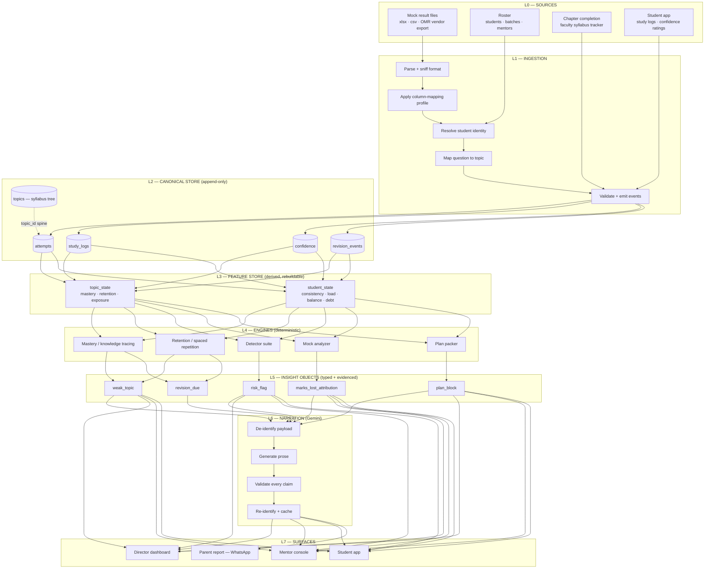
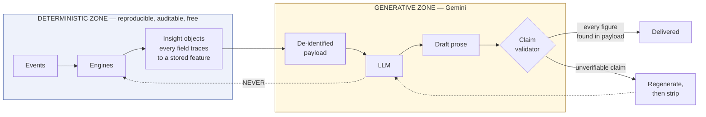
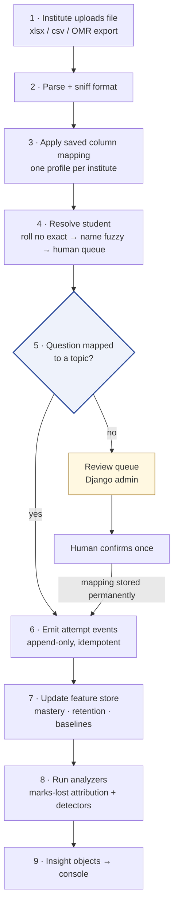
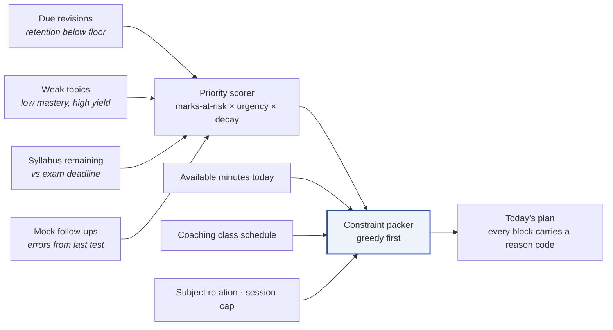
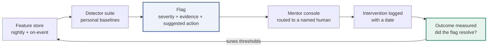
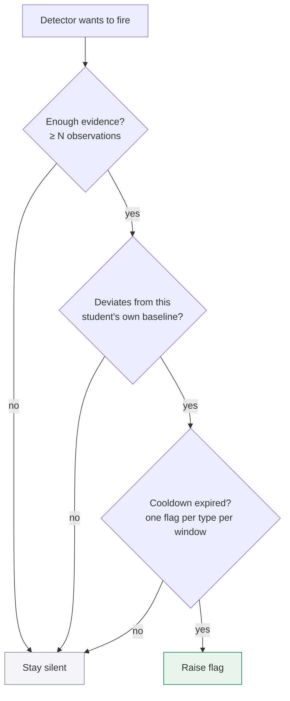
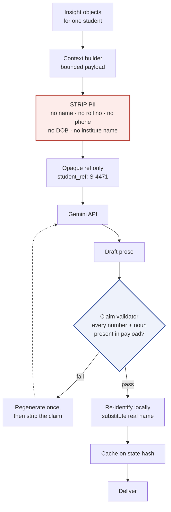
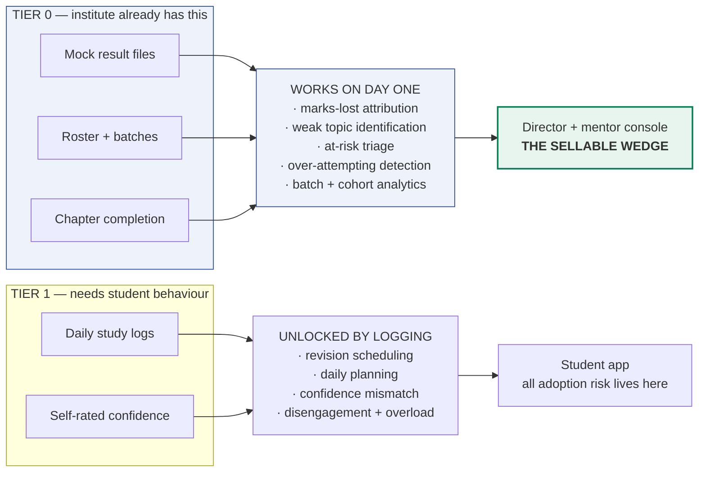
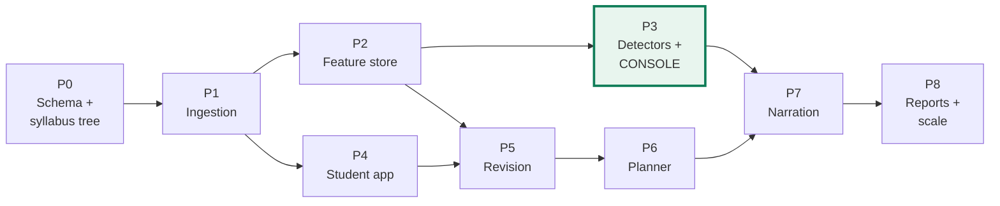
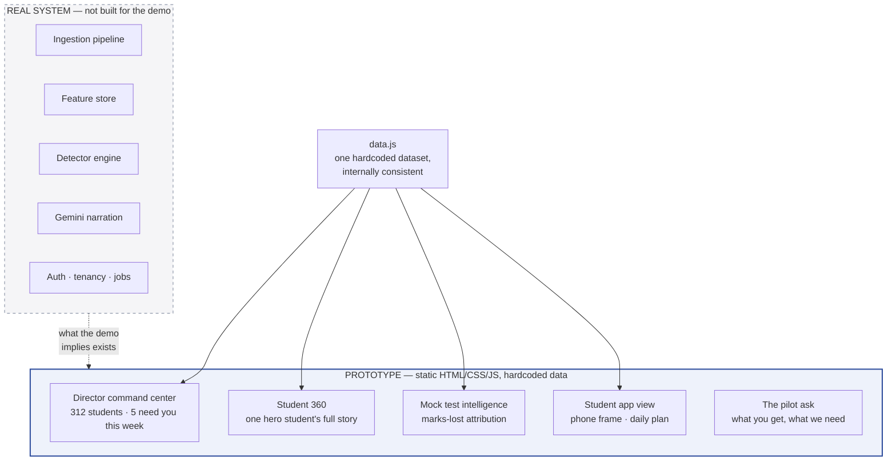

# Student AI — Workflow Diagrams

Visual reference for the whole system. Every diagram below is Mermaid and renders natively on GitHub, or in VS Code with the **Markdown Preview Mermaid Support** extension (free, by Matt Bierner). No account, no service, no connection required.

Companion to [`TECHNICAL_DOC.md`](TECHNICAL_DOC.md), which carries the reasoning and the tech choices.

---

## 1 · Master workflow — end to end

The whole system in one picture. Data moves strictly downward; no layer reaches past the one below it.

**Read this:** L5 is the seam. Everything above it is arithmetic on stored events. Everything below it is presentation. Surfaces read insight objects *directly* — narration is an enhancement layer, not a dependency. If Gemini is down, the product still works; it just stops writing sentences.

---

## 2 · The trust boundary — what the model is and is not allowed to do

**Read this:** the model has no write path back into state. It cannot change a score, raise a flag, or compute a number. This matters more with a cheaper model, not less — and it is what lets you answer a director's *"why did it say that?"* with a rule and its evidence.

---

## 3 · Flow A — Mock result file to actionable insight

The highest-value flow in the system, and the one most often underestimated.

**Read this:** step 5 is the gate. An unmapped attempt is a number with no meaning, so nothing downstream works without it. Mapping is a **one-time cost per question paper** that pays out on every future student who sits it — which is why it belongs in a permanent table with human confirmation, never as a runtime inference.

---

## 4 · Flow B — Four queues become one day's plan

**Read this:** the planner is a constrained packing problem, not a scheduling UI. Ship the greedy scorer — a weighted sort that fills slots until minutes run out is roughly 80% as good as constraint programming and takes a day rather than a month.

**The reason code is a retention feature, not a log line.** Unexplained plans get abandoned in week two.

---

## 5 · Flow C — The risk loop has to close

**Read this:** detection is the easy half. The return arrow is the product — it tunes detector thresholds against ground truth, and it produces the only number that renews a contract: *"of 23 students flagged last term, 17 recovered after mentor contact."*

Without it you have a system that generates worry, not outcomes.

### Alert hygiene — the three rules that keep mentors reading

Three wrong answers is noise, not a trend. A console that cries wolf in week one is ignored by week three — and you do not get a second chance with that mentor.

---

## 6 · Flow D — Narration, de-identified

Updated for Gemini. The de-identification step is **not optional** on the free tier.

**Read this:** Google's free tier may use submitted content to improve its products, with human review, and its terms tell you not to submit personal information. Your users are minors. Stripping PII before the call is what makes the free tier usable at all — and it costs nothing, because the payload is already a bounded structured object.

Re-identification happens locally, after generation. The model never sees a real name.

---

## 7 · Tier 0 vs Tier 1 — what works without student adoption

**Read this:** this is the architectural answer to *"who is actually going to enter all this data?"* — the question that kills ed-tech pilots. Tier 0 capabilities never read a study log, so they can be built, demoed and sold on files the institute already owns. The student app then arrives somewhere the system has already earned credibility, instead of asking for trust up front.

---

## 8 · Build order — the dependencies pick the sequence

**Read this:** P3 is reachable without P4 — that is the point of the tier split, and the reason the console is built before the student app. P7 sits deliberately late: narration's entire input is the output of P2 through P6, so building it earlier means prompting a model about data that does not exist yet.

---

## 9 · Prototype scope — what the demo actually covers

The demo is a **static frontend**. No backend, no database, no live model calls.

**Read this:** the prototype's job is to make a director believe the system works, not to be the system. Pre-write the narration text into `data.js` — do **not** call Gemini live in a demo. An API key in client-side JavaScript is exposed to anyone who opens devtools, and a weird generation in front of a buyer costs you the room.

Demo reliability beats live-ness. Every time.
